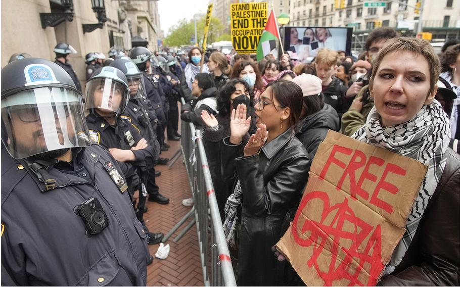

# 美国这次支持加沙运动的中心是哥伦比亚大学。目前抗议已持续十天
  #weibo 
---
t0mbkeeper

美国这次支持加沙运动的中心是哥伦比亚大学。目前抗议已持续十天，而且从哥大蔓延到了耶鲁、 麻省理工， 纽约大学等学校。  
  
1968 年的这个时候，哥伦比亚大学就发生过一次学生运动。1970 年的电影《The Strawberry Statement》、2007 年的电影《Across the Universe》都以这次学生运动为主题。感兴趣可以找来看看。  
  
起因是哥大学生发现自己的学校参与了美国国防部的武器研究。美国大学的主流是左翼，左翼是反战的。1968 年 3 月 27 日，哥大学生组织了一起示威活动，要求学校终止这个合作。如果光是这点事，倒也不算大。然而，一周后，也就是 1968 年 4 月 4 日，马丁·路德·金遇刺。  
  
反战，叠加上反种族主义，于是这场抗议演变成了一场大规模学生运动。1968 年 4 月 30 日，纽约市出动警察，一共拘捕了 700 余名抗议者。在冲突中，有约 132 名学生、4 名教职员工和 12 名警察受伤。所以，美国警察镇压学生运动并不是稀罕事。  
  
对美国政府为代表的利维坦们来说，学生运动的一大麻烦之处在于其天然的正义性。“天然的正义性”并不是说其主张一定正确。工人运动、农民运动，大多是为了自身利益。当然为了自身利益没什么不对。但仿佛就有点虚。如果是白领运动，那更完蛋——“既得利益者”还不满足吗？所以，前阵子韩国医生罢工，不少人就很反感。  
  
而学生运动往往不是为了自己，或者大部分不是为了自己。“为天下苍生振臂一呼”，这就是天然的正义性。年轻，缺乏社会经验，则是另一个护身符。即便不同意其主张的人，可能也只会觉得“这些孩子们太傻了”“被别有用心的人利用了”。  
  
学生运动的另一个麻烦之处在于其蔓延性。全美国的大学，都会由学生们在中学的校友关系连成网状结构。相对于 1968 年，现在有了智能手机和移动互联网。口号、标语、照片、视频，瞬间传遍。再加上大学生不用上班不用养家，旷课也不扣钱。于是一点星星之火，就能顿成燎原之势。  
  
所以，这次学生运动可能比当初“占领华尔街”更让白宫头疼。 

 

 
--- 
